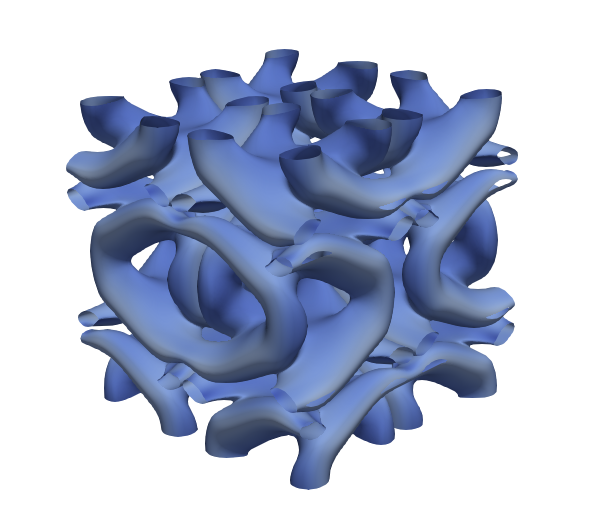
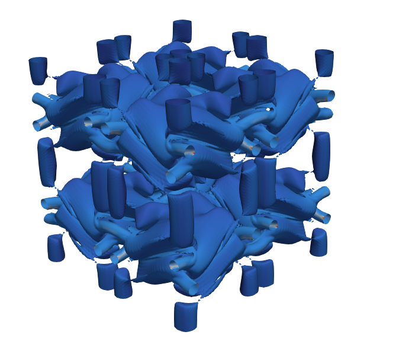
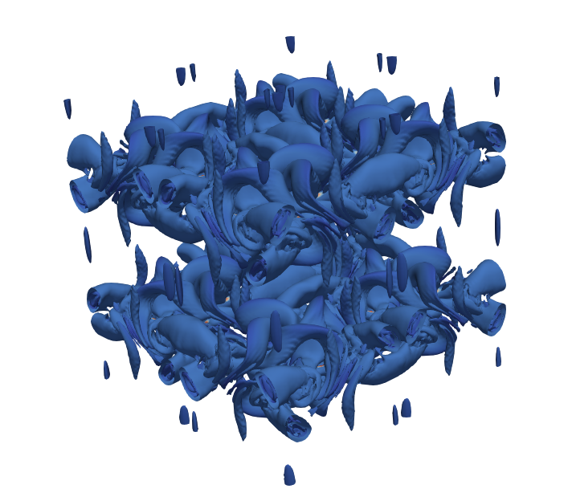
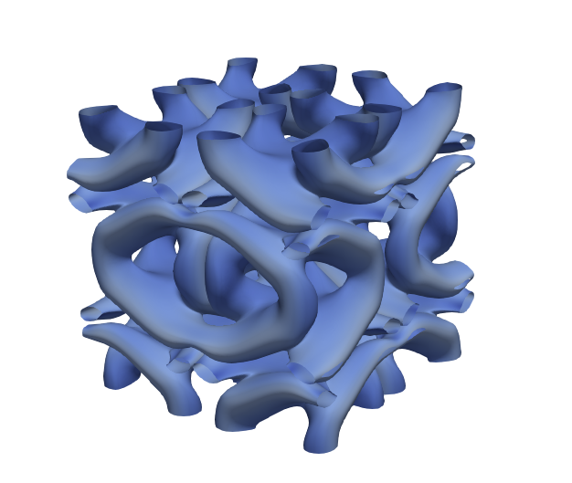
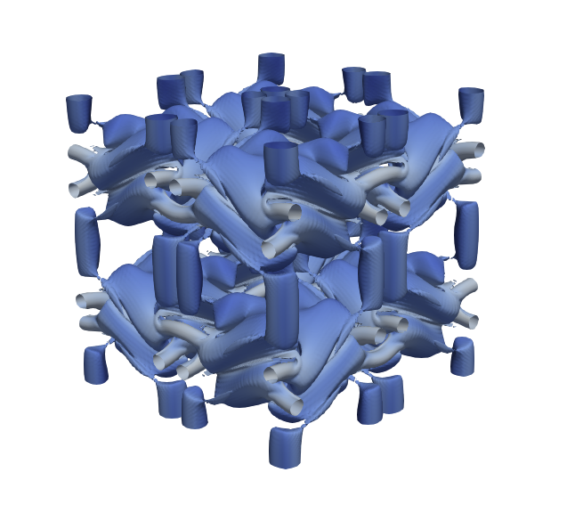
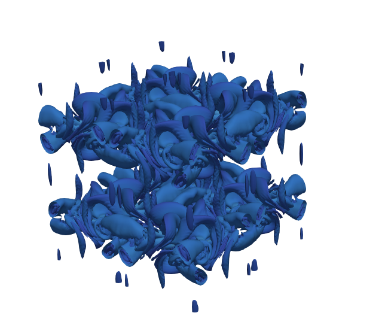
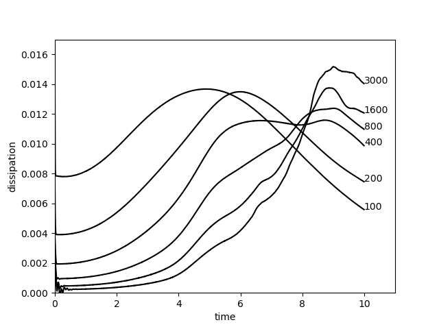
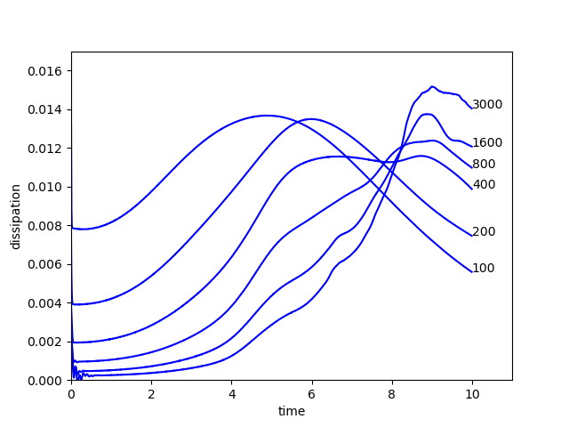
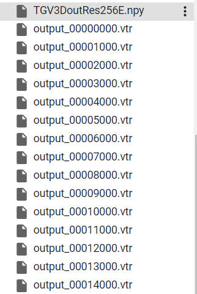
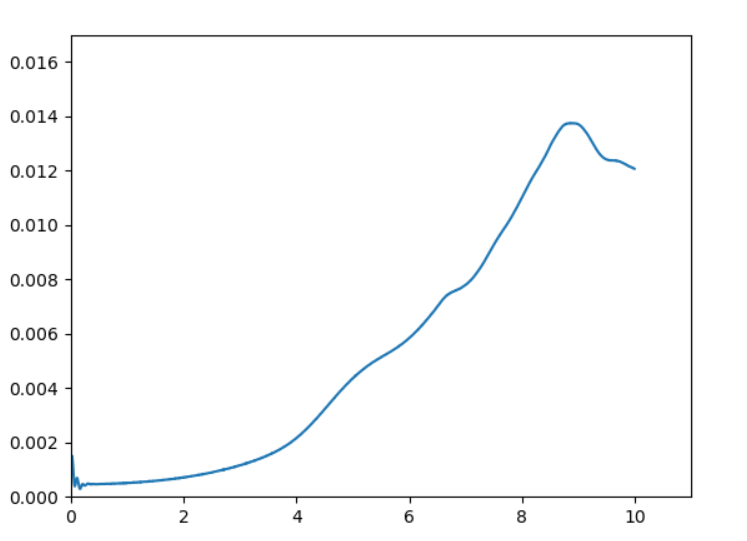

# lettuce_paddle


## 目录


- [1. 简介]()
- [2. 复现精度]()
- [3. 准备环境]()
- [4. 开始使用]()
- [5. LICENSE]()
- [6. 参考链接与文献]()


## 1. 简介

本项目为使用paddle复现lettuce项目,lettuce是一个基于LBM的计算流体动力学框架,具有gpu加速计算、二维和三维快速成型等优点。

**论文:** [Lettuce: PyTorch-based Lattice Boltzmann Framework](https://arxiv.org/pdf/2106.12929.pdf)

**参考repo:** [https://github.com/lettucecfd/lettuce](https://github.com/lettucecfd/lettuce)
                                        
快速使用可参考[AIStudio](https://aistudio.baidu.com/aistudio/projectdetail/3838999?contributionType=1&shared=1)        

感谢百度飞桨提供的算力支持


## 2. 复现精度

### 图1 三维Taylor-Green旋涡Q准则等值面，雷诺数和网格分辨率分别为1600和256

原代码生成的vtr文件在paraview显示结果（从左到右分别为t=5000,t=7000,t=10000)：
<div>
    
     
    
</div>

采用相同参数（着色有一点区别，便于区分）本项目代码生成的vtr文件在paraview显示结果：
<div>
    
     
    
</div>                                       

可以从[BaiduYun](https://pan.baidu.com/s/1p8N9yoqkVypHZDUUsgFhAA?pwd=cexk)处下载本项目t=5000,t=7000,t=10000生成的vtr文件

### 图2 能量耗散率

使用原代码计算−dk/dt得到的结果：
<div>
    
</div>   

使用本项目代码计算−dk/dt得到的结果：
<div>
    
</div>                                          
                                        
可以从[BaiduYun](https://pan.baidu.com/s/1p8N9yoqkVypHZDUUsgFhAA?pwd=cexk)处下载本项目生成的6个TGV3DoutRes256E.npy文件             

## 3. 准备环境

* 下载代码

```bash
git clone https://github.com/simonsLiang/lettuce_paddle
```

* 安装paddlepaddle

```bash
# 需要安装2.2及以上版本的Paddle
# 安装GPU版本的Paddle
pip install paddlepaddle-gpu==2.2.0

更多安装方法可以参考：[Paddle安装指南](https://www.paddlepaddle.org.cn/)。

* 安装requirements
```bash
pip install -r requirements.txt
```

## 4. 开始使用

下面代码将在GPU上运行一个三维Taylor-Green旋涡

```
import lettuce as lt
import paddle
import numpy as np
import matplotlib.pyplot as plt
device = 'gpu'  
lattice = lt.Lattice(lt.D3Q27, device=device, dtype=paddle.float32) 
resolution = 80
flow = lt.TaylorGreenVortex3D(resolution, 1600, 0.05, lattice)
collision = lt.BGKCollision(lattice, tau=flow.units.relaxation_parameter_lu)
streaming = lt.StandardStreaming(lattice)
simulation = lt.Simulation(flow, lattice, collision, streaming)
print("MLUPS: ", simulation.step(100))
```

运行
```
python run.py --resolution 256 --reynolds 1600
```
将会每隔1000步生成网格数为255x256x256,雷诺数位1600的vtr文件，可在第三方软件比如paraview进行仿真，同时得到动能变化数值，保存于TGV3DoutRes256E.npy中，如下：
<div>
    
</div>     

运行
```
python plotE.py --filename TGV3DoutRes256E.npy --savename ./dissipation.png
```
将会在根据TGV3DoutRes256E.npy绘制能量耗散曲线，保存于./dissipation.png中，如下：

<div>
    
</div>      

## 5. LICENSE

[Apache License 2.0](./LICENSE)


## 6. 参考链接与文献
[Lettuce: PyTorch-based Lattice Boltzmann Framework](https://arxiv.org/pdf/2106.12929.pdf)
